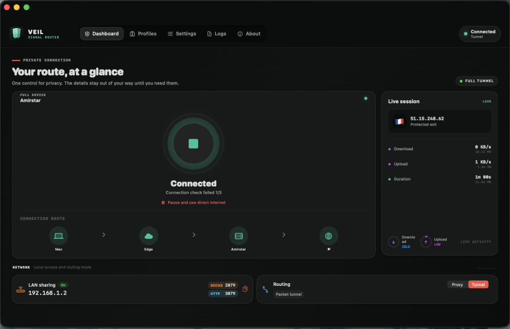
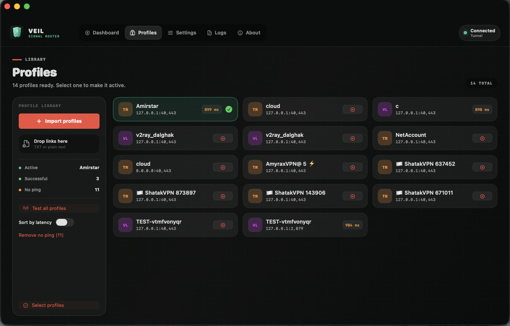
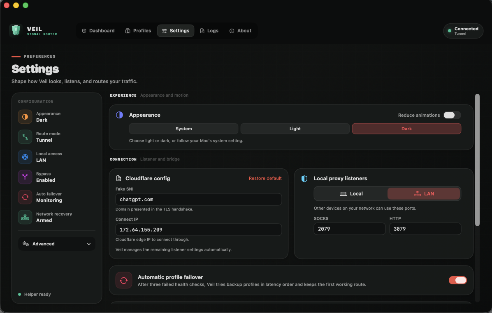
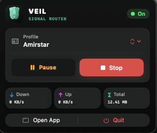

# ویل (Veil)

[English](README.md)

**ویل (Veil) یک اپلیکیشن مدرن macOS برای اتصال به کانفیگ‌های CDN بدون دردسرهای معمول و همراه با قابلیت دستکاری و اسپوفینگ سطح پایین SNI است.**

پروفایل‌ها را وارد کنید، پینگ واقعی بگیرید، بهترین گزینه را انتخاب کنید و وصل شوید. ویل اتصال را آماده می‌کند و تنظیمات لازم macOS را خودش انجام می‌دهد تا لازم نباشد با اسکریپت، ترمینال یا چند کلاینت جداگانه درگیر شوید.

<table>
  <tr>
    <td align="center" width="50%">
      <strong>Dashboard</strong> 
      
    </td>
    <td align="center" width="50%">
      <strong>Profiles</strong> 
      
    </td>
  </tr>
  <tr>
    <td align="center">
      <strong>Settings</strong> 
      
    </td>
    <td align="center">
      <strong>نوار منو</strong> 
      
    </td>
  </tr>
</table>

## قابلیت‌ها و امکانات

- **اسپوفینگ و جعل SNI در سطح شبکه:** ارسال بسته‌های سفارشی TLS ClientHello و تکنیک‌های شماره sequence در TCP جهت عبور از فیلترینگ مبتنی بر SNI در شبکه‌های محدود شده.
- **حالت Tunnel تمام‌عیار در macOS:** یکپارچگی نیتیو با NetworkExtension و utun برای مسیردهی تمام ترافیک سیستم بدون نیاز به تنظیمات دستی پروکسی در هر برنامه.
- **حالت System Proxy:** مسیردهی سبک‌تر از طریق پروکسی SOCKS5 و HTTP سیستم‌عامل برای مواقعی که فقط به مسیردهی سطح برنامه نیاز دارید.
- **میان‌بر و بای‌پاس هوشمند (Geosite & Domain Bypass):** پشتیبانی از قواعد Geosite (مانند سایت‌های ایرانی، تبلیغات، استریم و غیره) و دامنه/آی‌پی‌های سفارشی برای عبور مستقیم ترافیک داخلی از پروکسی.
- **مدیریت هوشمند پروفایل و پینگ واقعی:** قابلیت وارد کردن لینک کانفیگ‌ها (VLESS، Shadowsocks، Trojan و ...)، drag & drop فایل‌های متنی یا JSON، پینگ دسته‌جمعی واقعی تا مقصد، حذف کانفیگ‌های خرابی که پینگ ندارند و خروجی گرفتن مجدد از لینک‌ها.
- **داشبورد زنده و تحلیل IP خروجی:** نمایش مسیر اتصال، استعلام خودکار IP و کشور خروجی، شمارشگر مصرف ترافیک و نمودارهای فعالیت زنده.
- **کنترل سریع از Menu Bar:** امکان قطع/وصل اتصال، تغییر پروفایل فعال، مشاهده وضعیت IP خروجی و دسترسی سریع به برنامه‌ها از نوار منوی macOS.
- **برنامه مستقل و بدون نیاز به پیش‌نیاز:** شامل Xray-core و لایسنر پایتونی داخلی به‌صورت binary بدون نیاز به نصب پایتون، core یا دستورات ترمینال.

## دانلود

آخرین فایل **DMG** را از [GitHub Releases](https://github.com/uidops/veil/releases) دریافت کنید.

بعد از باز کردن DMG، برنامه **Veil** را به **Applications** بکشید.

چون ویل یک community build متن‌باز است، macOS ممکن است برای اجرای اول تایید بخواهد. اگر چنین شد، به **System Settings -> Privacy & Security** بروید و **Open Anyway** را بزنید.

## شروع سریع

1. برنامه Veil را باز کنید.
2. مجوز دسترسی اولیه helper را تایید کنید.
3. پروفایل‌ها را وارد یا paste کنید.
4. پینگ بگیرید و یک پروفایل سالم انتخاب کنید.
5. حالت اتصال (**Tunnel Mode** یا **System Proxy**) را انتخاب کرده و روی **Connect** بزنید.

ایده همین است: شما یک پروفایل سالم می‌آورید، ویل بقیه کارها را انجام می‌دهد.

## حمایت مالی

اگر ویل برایتان مفید بود، می‌توانید از توسعه آن حمایت کنید:

- **TON:** `UQD1OPPvt1PgKqiU2xYzb5MX3M9pIxz32SpdskkLzNmJn1na`
- **USDT (BEP20):** `0x4FcB75ECaf89653aB4bB7B8706202823617ACbAB`
- **TRX (TRON):** `TD6jvEDBQFYVEw7tDmvmnFbmi29GvyEAPZ`

## لایسنس

به [LICENSE](LICENSE) مراجعه کنید.
